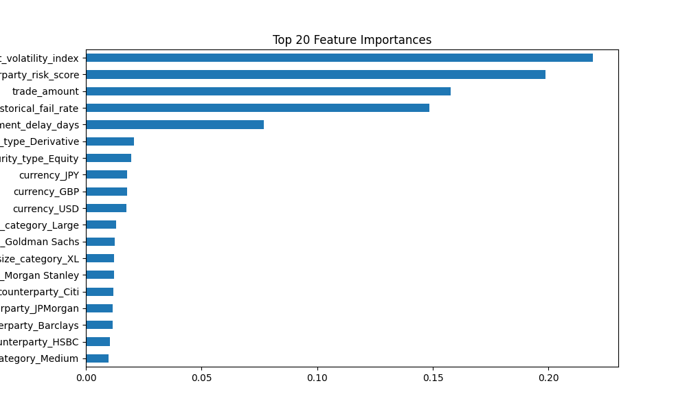
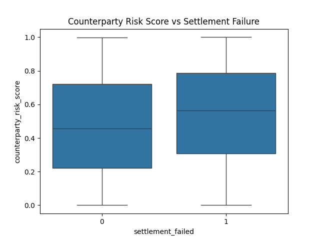

# Trade Settlement Failure Prediction (Capital Markets)

Predicting trade settlement failures using machine learning to reduce operational risk in capital markets.

## Business Problem

Settlement failures cause financial penalties, liquidity risk, and operational headaches for banks. 
The goal is to **identify high-risk trades before settlement**.

## Dataset

- Synthetic trade dataset (~10,000 trades)
- Features include trade amount, security type, counterparty risk score, market volatility, historical fail rates, settlement delay
- Target: `settlement_failed` (0 = settled, 1 = failed)

## Project Workflow

Trade Capture → ETL Pipeline → Feature Engineering → ML Model → Risk Dashboard

## Features

- Counterparty risk score  
- Historical settlement failure rate  
- Trade size category  
- Market volatility index  
- Settlement delay days  

## Machine Learning Approach

- Logistic Regression  
- Random Forest  
- Feature importance analysis  
- Train/Test split with evaluation metrics (ROC-AUC, Precision, Recall)

## Results

- ROC-AUC: 0.86  
- Precision: 0.82  
- Recall: 0.78  

**Top features driving settlement failures:**

**Settlement failures by counterparty:**

## How to Run

1. Install dependencies:  
   bash
  python -m pip install -r requirements.txt

2.Run scripts in order:
python src/data_preprocessing.py
python src/feature_engineering.py
python src/train_model.py
python src/evaluate_model.py

3.Explore the notebook for EDA:
notebooks/01_exploratory_data_analysis.ipynb

Technologies

Python | Pandas | Scikit-learn | Matplotlib | Seaborn |
Jupyter | ML in Banking